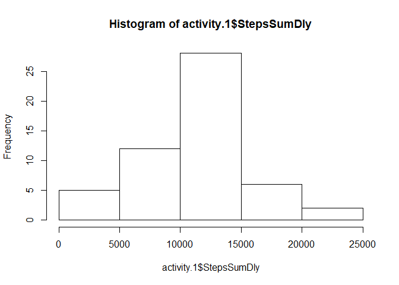
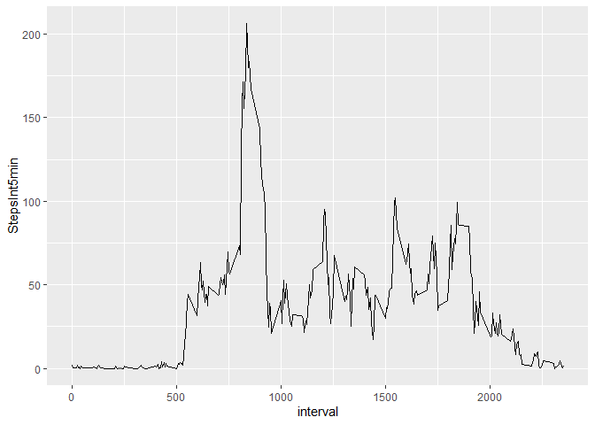
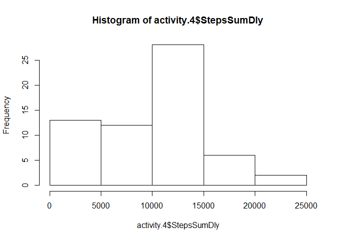
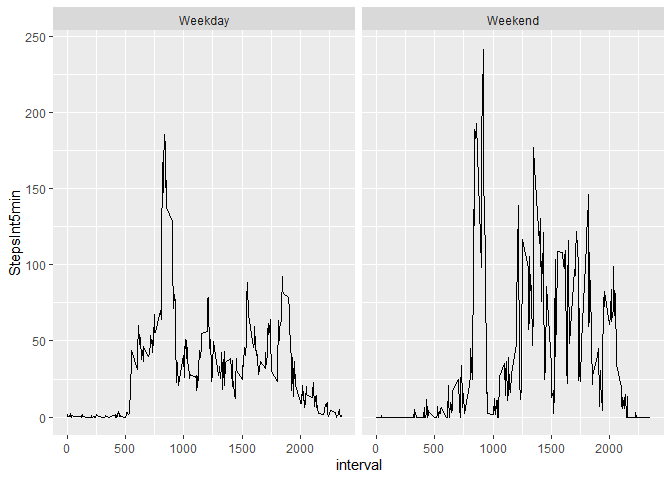

## Loading and preprocessing the data


```r
library(dplyr)
```

```
## 
## Attaching package: 'dplyr'
```

```
## The following objects are masked from 'package:stats':
## 
##     filter, lag
```

```
## The following objects are masked from 'package:base':
## 
##     intersect, setdiff, setequal, union
```

```r
library(lubridate)
```

```
## 
## Attaching package: 'lubridate'
```

```
## The following object is masked from 'package:base':
## 
##     date
```

```r
library(Hmisc)
```

```
## Warning: package 'Hmisc' was built under R version 3.6.2
```

```
## Loading required package: lattice
```

```
## Loading required package: survival
```

```
## Warning: package 'survival' was built under R version 3.6.2
```

```
## Loading required package: Formula
```

```
## Loading required package: ggplot2
```

```
## 
## Attaching package: 'Hmisc'
```

```
## The following objects are masked from 'package:dplyr':
## 
##     src, summarize
```

```
## The following objects are masked from 'package:base':
## 
##     format.pval, units
```

```r
library(ggplot2)
activity<-read.csv("activity.csv")
```

## What is mean total number of steps taken per day?


### 1. Calculate the total number of steps taken per day

```r
activity.1<-filter(activity,!is.na(steps)) %>%
  mutate(Date=ymd(date)) %>%
  select(Date,steps) %>%
  group_by(Date) %>% 
  summarise(StepsSumDly=sum(steps))
```
### 2. Make a histogram of the total number of steps taken each day


```r
hist(activity.1$StepsSumDly)
```

<!-- -->

### 3. Calculate and report the mean and median of the total number of steps taken per day

```r
summary(activity.1$StepsSumDly)
```

```
##    Min. 1st Qu.  Median    Mean 3rd Qu.    Max. 
##      41    8841   10765   10766   13294   21194
```

## What is the average daily activity pattern?
### 1. Make a time series plot (i.e. type = "l") of the 5-minute interval (x-axis) and the average number of steps taken, averaged across all days (y-axis) - I decided to use ggplot2


```r
activity.2<-filter(activity,!is.na(steps)) %>%
  select(interval,steps) %>%
  group_by(interval) %>% 
  summarise(StepsInt5min=mean(steps))

ggplot(activity.2,aes(interval,StepsInt5min))+geom_line()
```

<!-- -->

### 2. Which 5-minute interval, on average across all the days in the dataset, contains the maximum number of steps? The graph shows early morning peak reach at 8:35.


```r
  activity.2$interval[which.max(activity.2$StepsInt5min)]
```

```
## [1] 835
```

## Imputing missing values

### 1. Calculate and report the total number of missing values in the dataset (i.e. the total number of rows with NAs) - There are 2,304 NA values.


```r
sum(is.na(activity))
```

```
## [1] 2304
```

```r
summary(activity)
```

```
##      steps                date          interval     
##  Min.   :  0.00   2012-10-01:  288   Min.   :   0.0  
##  1st Qu.:  0.00   2012-10-02:  288   1st Qu.: 588.8  
##  Median :  0.00   2012-10-03:  288   Median :1177.5  
##  Mean   : 37.38   2012-10-04:  288   Mean   :1177.5  
##  3rd Qu.: 12.00   2012-10-05:  288   3rd Qu.:1766.2  
##  Max.   :806.00   2012-10-06:  288   Max.   :2355.0  
##  NA's   :2304     (Other)   :15840
```

### 2. Devise a strategy for filling in all of the missing values in the dataset. The strategy does not need to be sophisticated. For example, you could use the mean/median for that day,or the mean for that 5-minute interval, etc. -  For this we use the hmisc thatn contains a useful impute function that can use the median of values to fill in NA values.  Package loaded at the begning of documente but repeated here for illustration purpos:


```r
library(Hmisc)
```

### 3.Create a new dataset that is equal to the original dataset but with the missing data filled in.


```r
activity.3<-read.csv("activity.csv")
activity.3$steps<-with(activity.3, impute(steps, median))

summary(activity.3)
```

```
## 
##  2304 values imputed to 0
```

```
##      steps                date          interval     
##  Min.   :  0.00   2012-10-01:  288   Min.   :   0.0  
##  1st Qu.:  0.00   2012-10-02:  288   1st Qu.: 588.8  
##  Median :  0.00   2012-10-03:  288   Median :1177.5  
##  Mean   : 32.48   2012-10-04:  288   Mean   :1177.5  
##  3rd Qu.:  0.00   2012-10-05:  288   3rd Qu.:1766.2  
##  Max.   :806.00   2012-10-06:  288   Max.   :2355.0  
##                   (Other)   :15840
```

### 4. Make a histogram of the total number of steps taken each day. Calculate and report the mean and median total number of steps taken per day. Do these values differ from the estimates from the first part of the assignment? What is the impact of imputing missing data on the estimates of the total daily number of steps?
### Here we see due to large number of NA values imputed with 0 value have skewed mean steps for 5 min interval from  37.38 to 32.48 and total daily steps from  10766 to 9354.  Not terrible but a bit more investigation to determine if better impute strategy would make data more accurate. Also, the histogram is no longer close to being normally distributed.


```r
activity.4<-mutate(activity.3,Date=ymd(date)) %>%
  select(Date,steps) %>%
  group_by(Date) %>% 
  summarise(StepsSumDly=sum(steps))

hist(activity.4$StepsSumDly)
```

<!-- -->

```r
summary(activity.4$StepsSumDly)
```

```
##    Min. 1st Qu.  Median    Mean 3rd Qu.    Max. 
##       0    6778   10395    9354   12811   21194
```


## Are there differences in activity patterns between weekdays and weekends?


### 1.Create a new factor variable in the dataset with two levels – “weekday” and “weekend” indicating whether a given date is a weekday or weekend day. 


```r
activity.5<-mutate(activity.3,Week=weekdays(ymd(date)))
activity.5$Week[activity.5$Week=="Saturday" | activity.5$Week=="Saturday"]<-"Weekend"
activity.5$Week[activity.5$Week!="Weekend"]<-"Weekday"
table(activity.5$Week)
```

```
## 
## Weekday Weekend 
##   15264    2304
```

### 2. Make a panel plot containing a time series plot (i.e.type="l") of the 5-minute interval (x-axis) and the average number of steps taken, averaged across all weekday days or weekend days (y-axis). 


```r
activity.6<-select(activity.5,interval,steps,Week) %>%
  group_by(interval,Week) %>% 
  summarise(StepsInt5min=mean(steps))

ggplot(activity.6,aes(interval,StepsInt5min))+geom_line()+facet_wrap((~Week))
```

<!-- -->

### People seem to be more active during the weekend as during the weekday people are working on their desk and can't move too much. This suggests people should be more creative during weekdays to be more phyiscally active.


